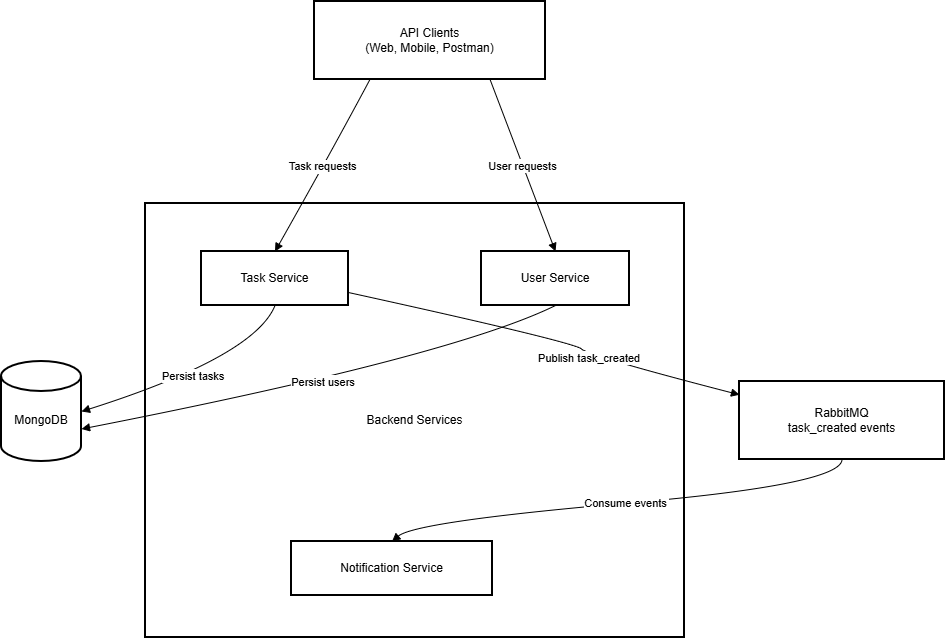

# Node.js Microservices Project with Docker, MongoDB & RabbitMQ
This project is a **simple microservices-based application** built with **Node.js**, **Docker**, **MongoDB**, and **RabbitMQ**.

It demonstrates how multiple services can communicate with each other using **message queues** instead of direct API calls.

The project is beginner-friendly for **learning microservices concepts**.

**Architecture Diagram**


**Services Overview**

This application consists of **three microservices**:

**User Service**
- Manages users
- Stores user data in MongoDB
- Runs on port `3001`

**Task Service**
- Creates and fetches tasks
- Stores tasks in MongoDB
- Sends task creation events to RabbitMQ
- Runs on port `3002`

**Notification Service**
- Listens for task creation events from RabbitMQ
- Logs notifications when a new task is created
- Runs on port `3003`

**Tech Stack**
- Node.js
- Express.js
- MongoDB
- RabbitMQ
- Docker & Docker Compose

## 📂 Project Structure

```text
.
├── user-service
│   ├── Dockerfile
│   └── index.js
├── task-service
│   ├── Dockerfile
│   └── index.js
├── notification-service
│   ├── Dockerfile
│   └── index.js
├── docker-compose.yml
├── .env.example
├── .gitignore
└── README.md


```

**Start the application**
docker-compose up --build


**How Services Communicate**
1.A task is created using Task Service

2.Task Service saves the task in MongoDB

3.Task Service sends a message to RabbitMQ

4.Notification Service consumes the message

5.Notification Service logs the notification
